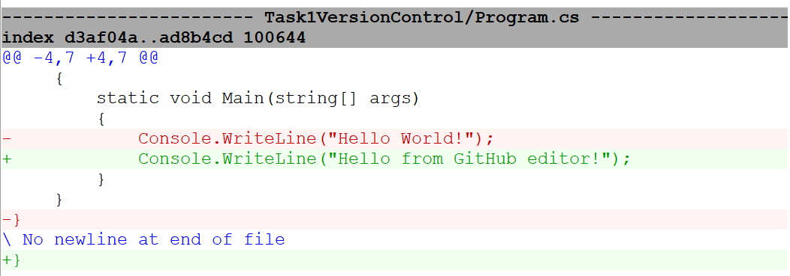
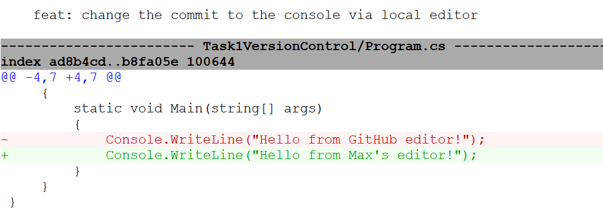
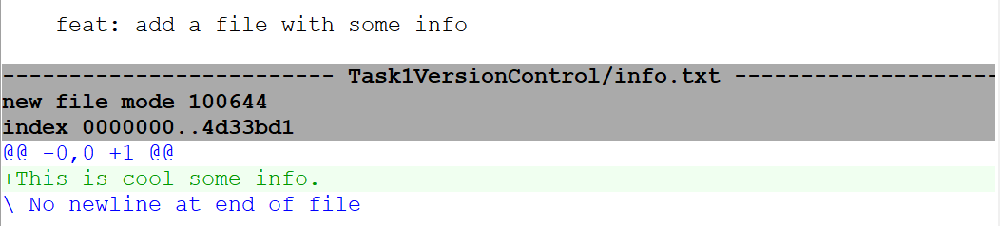
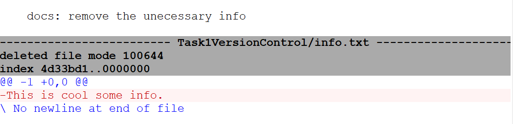
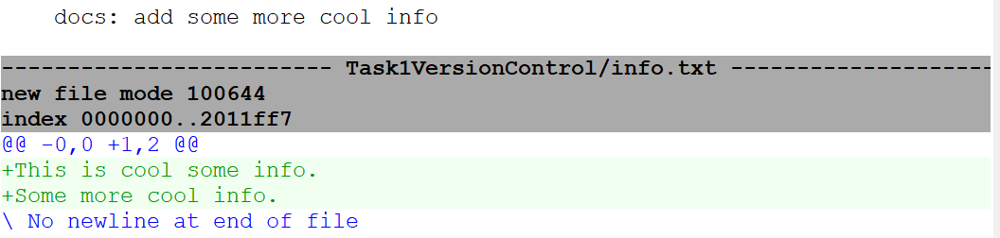

# Version Control and Git
## Requirements

Requirements for my assignment on the Git and Version Control Lesson
- Create a repository using Git​
- Add `.gitignore` file (for Visual studio)​
- Set it up with SSH​
- Do several test commits​
- Reproduce a text conflict and explain how you resolved it​
- Reproduce a deleted file conflict and explain how you resolved it​
- Create a branch from main and do several commits to the branch​
- Merge and delete the branch​
- Read the reference from “Commit messages”​

## Solution

#### Getting Access

To begin with, I needed a secure way of authentication on my machine in order to make changes to my GitHub repositories. 

Thus, I have used the following command, in order to generate an SSH key pair:

```
ssh-keygen -t ed25519 -C "max...@gmail.com"
```

Then, I have copied the contents of the generated file, `../.ssh/id_ed25519.pub`, which contains the public key and I accessed this location on GitHub: `Settings > SSH and GPG keys > New SSH Key`, in order to save my public key there, completing this part.

#### Creating the Repos

I have created a directory locally, which I have opened using Visual Studio, where I have accessed the terminal and instantiated the following command, so that this folder will be tracked by Git:

```
git init
```

Then, I have instantiated a GitHub [Repo](https://github.com/MaxNoragami/AmdarisIntern), which I have added as a remote origin, to my local one, in order to sync changes to it.

```
git remote add origin git@github.com:MaxNoragami/AmdarisIntern.git
```

#### Other Manipulations

As requested, I have generated a `.gitignore` file for Visual Studio and some other IDEs using [gitignore.io](https://www.toptal.com/developers/gitignore/).
Then I have done some other test commits.

### Conflicts
#### Text Conflict

In order to intentionally cause a text conflict, I have used the GitHub online editor in order to modify a line of code.



Then, after committing the changes on GitHub, I have also made a change to `Console.WriteLine("Hello World!");`, but via the local editor.



As visible from the screenshot, I have committed the local changes. However, once I tried pulling the changes from the remote branch, in order to push my changes,  I had to resolve a text conflict.

I had three choices, either keep the local changes, the changes from the remote, or append them both, so I have chosen the local changes only as seen in screenshot where the difference between the commits is shown.

#### Deleted File Conflict

Again, as requested, I have fabricated a delete file conflict, as well.
But before causing the actual conflict, I have created a file on the local repo with some data on it.



After, pushing the changes to the remote, on my separate branch `Task1-VersionControl`, I decided to remove and commit the action on the remote, via the GitHub, as seen in the image:



Meanwhile, on the local, I have added some more data to the file, so once I pulled the changes off the remote, with the aim of syncing the files across the repos, a *deleted file conflict* occurred, as the file had been missing on the remote but was present on the local with some changes made to it.




Again, I had the choice of whether to delete the file on local or keep it, so I have decided to keep it and push those changes, the file appearing on the remote, as well.

### The Other Required Tasks

For the left requirements, such as creating a branch and making some commits to it, and eventually merge it to the `main` branch, I have pushed all of the previous commits to 'Task1-VersionControl', which has been merged as requested.

Moreover, I have deleted the branch locally using:

```
git branch -d Task1-VersionControl
```

As for the branch on the remote, I decided to keep it, but it is removable via GitHub.

Last but not least, I have used `gitk`, the graphical repository browser, in order to read the references or any details related to the “Commit messages”​.